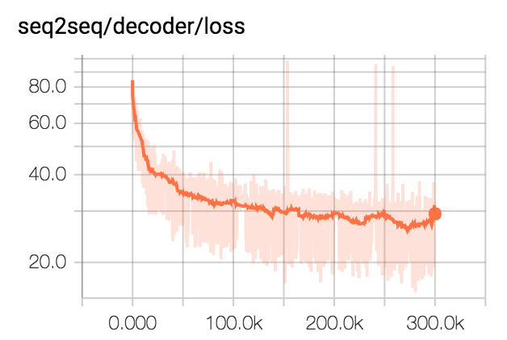

# Tensorflow Seq2seq Text Summarization

**This branch uses new tf.contrib.seq2seq APIs in tensorflow r1.1. For r1.0 users, please check [Branch tf1.0](https://github.com/thunlp/TensorFlow-Summarization/tree/tf1.0)**

---

This is an implementation of sequence-to-sequence model using a bidirectional GRU encoder and a GRU decoder. This project aims to help people start working on **Abstractive Short Text Summarization** immediately. And hopefully, it may also work on machine translation tasks. 

## Dataset
Please check [harvardnlp/sent-summary](https://github.com/harvardnlp/sent-summary).

## Pre-trained Models
[Download](https://drive.google.com/drive/folders/1IiwyHBzK7xvUtMrRY7VHzIRJzkzXn4LM?usp=sharing)

## Usage
Please download the dataset and put all `.txt` into `data/`. 

```python3 script/train.py``` can reproduce the experiments shown below. 

By doing so, it will train 200k batches first. Then do generation on `[giga, duc2003, duc2004]` with beam_size in `[1, 10]` respectively every 20k batches. It will terminate at 300k batches. Also, the model will be saved every 20k batches. 

```python3 script/test.py``` will automatically use the most updated model to do generation. 

For advanced users, ```python3 src/summarization.py -h``` can print help. Please check the code for details. 

## Implementation Details

### Bucketing
In tensorflow r0.11 and earlier, using bucketing is recommended. r1.0 provides dynamic rnn seq2seq framework which is much easier to understand than the tricky bucketing mechanism. 

We use dynamic rnn to generate compute graph. There is only one computing graph in our implemention. However, we still split the dataset into several buckets and use data from the same bucket to create a batch. By doing so, we can add less padding, leading to a better efficiency. 

### Attention Mechanism
The attention mechanism follows [Bahdanau et. al](https://arxiv.org/abs/1409.0473).

We follow the implementation in tf.contrib.seq2seq. We refine the softmax function in attention so that paddings always get 0. 

### Beam Search
For simplicity and flexibility, we implement the beam search algorithm in python while leave the network part in tensorflow. In testing, we consider batch\_size as beam\_size. The tensorflow graph will generate only 1 word, then some python code will create a new batch according to the result. By iteratively doing so, beam search result is generated. 

Check `step_beam(...)` in `bigru_model.py` for details.

## Results
We train the model for 300k batches with batch size 80. We clip all summaries to 75 bytes. For DUC datasets, we eliminate EOS and generate 12 words. For GIGA dataset, we let the model to generate EOS. 

### Negative Log Likelihood of Sentence


### Rouge Evaluation
|Dataset|Beam Size|R1-R|R1-P|R1-F|R2-R|R2-P|R2-F|RL-R|RL-P|RL-F|
|:--:|:--:|:--:|:--:|:--:|:--:|:--:|:--:|:--:|:--:|:--:|
duc2003 | 1 | 0.25758 | 0.23003 | 0.24235 | 0.07511 | 0.06611 | 0.07009 | 0.22608 | 0.20174 | 0.21262
duc2003 | 10 | 0.27312 | 0.23864 | 0.25416 | 0.08977 | 0.07732 | 0.08286 | 0.24129 | 0.21074 | 0.22449
duc2004 | 1 | 0.27584 | 0.25971 | 0.26673 | 0.08328 | 0.07832 | 0.08046 | 0.24253 | 0.22853 | 0.23461
duc2004 | 10 | 0.28024 | 0.25987 | 0.26889 | 0.09377 | 0.08631 | 0.08959 | 0.24849 | 0.23048 | 0.23844
giga | 1 | 0.3185 | 0.38779 | 0.3391 | 0.14542 | 0.17537 | 0.15393 | 0.29925 | 0.363 | 0.3181
giga | 10 | 0.30179 | 0.41224 | 0.33635 | 0.14378 | 0.1951 | 0.15936 | 0.28447 | 0.38733 | 0.31664


## Requirement
* Python3
* Tensorflow r1.1

## TODO
* Improve automatic scripts by parameterizing magic numbers. 
* Some tricks caused by new tensorflow seq2seq framework. 
